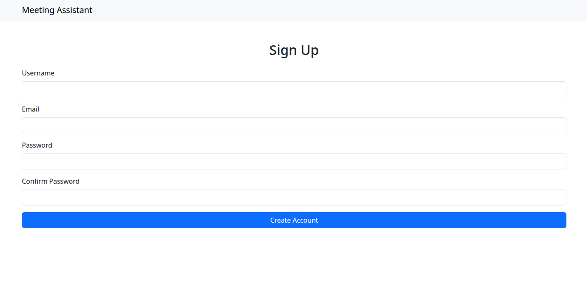

# Meeting Assistant

FastAPI + Mako signup boilerplate with PostgreSQL.

## Installation

```bash
# Clone & enter directory
git clone https://github.com/newbie-design-group/meeting-assistant.git
cd meeting-assistant

# Virtualenv & deps
python -m venv venv
source venv/bin/activate
pip install -r requirements.txt

## Signup Page Preview


